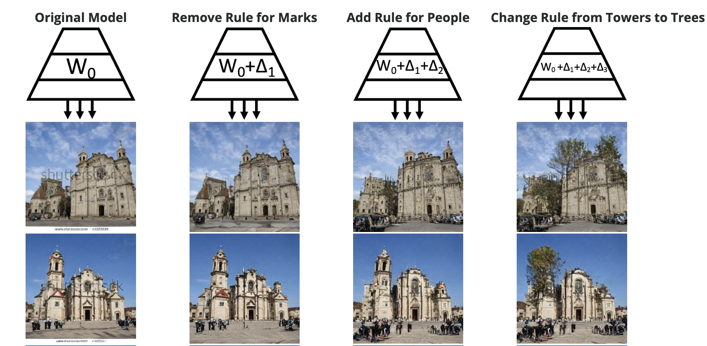
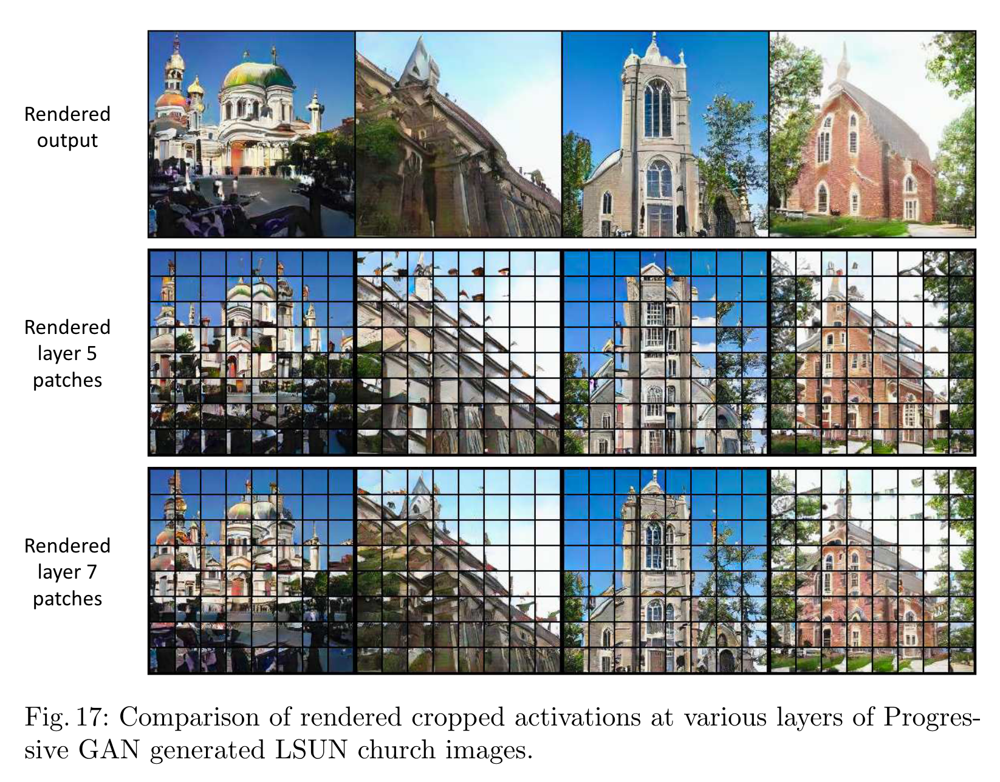

📌TL;DR: **Can the Rules in a Deep Network be Rewritten?**

## Problem 
* **👀 Motivation**: It is obscure that how a deep generative model such as GAN encode the rules or how a rule could be changed. 

* **❓ General Problem**: How to manipulate a specific rules encoded by a deep generative model.

* **✅ Solved**: Edit the images or a generator for removing, adding, replacing the selected parts by manipulating a layer of a deep network as a linear associative memory. 

* **🤔 Unsolved**: 
  - Can we extend this method which was applied to GAN to other architecture such as Transformers or diffusion-based models?
  - Which layer should we edit? This is decided manually. 
  - How about rewriting rules in language models or audio models?

* **💡 New Problem** : 
  - While this kind of copy-and-paste approach gives the creativity to model such as a tree sprouting from a tower, we may need a filter or a method to prevent a creative, but realistic generation. 

* **🌹 if the proposed algorithm fundamentally solves the given problem and if it does, think about which aspect of the algorithm makes the problem solved**
  - It is a key that hypothesis that the weights of a generator act as Optimal Linear Associative Memory (OLAM). OLAM is a classic single-layer neural data structure for memorizing associations that was described by Teuvo Kohonen and James A Anderson (independently) in the 1970s. They hypothesize that within a large modern multilayer convolutional network, the each individual layer plays the role of an OLAM that stores a set of rules that associates keys, which denote meaningful context, with values, which determine output.

# Paper

### Paper Info 
* Title : Rewriting a Deep Generative Model
* Authors: 	David Bau, Steven Liu, Tongzhou Wang, Jun-Yan Zhu, Antonio Torralba
* Publication : 2020.07.30
* paper link : https://arxiv.org/abs/2007.15646

### Page Info 
* Contributors: Sehyun Lee

## Summary 

## Discussion
Can we find Optimal Linear Associative Memory (OLAM) other than convolutional layers?
