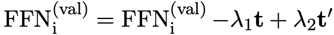
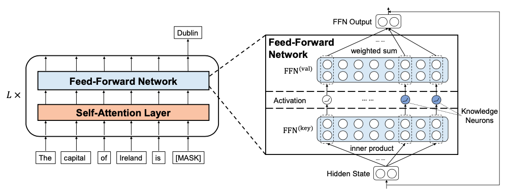

📌TL;DR: **How to understand the storage of knowledge within pre-trained Transformers and leverage knowledge neurons to edit specific factual knowledge without fine-tuning**

## Problem 
* **👀 Motivation**: Most previous work focuses on evaluating the overall accuracy of text-form knowleddge prediction → need to look deeper

* **❓ General Problem**: Find knowledge neurons expressing relational facts in the Transformer, and edit the specific factual knowledge.

* **✅ Solved**:
  - **To identify the knowledge neurons**
    + Employ the fill-in-the-blank cloze task.
    + Propose a knowledge attribution method based on integrated gradients   
    → If the neuron has a great influence on the expression of a fact, the gradient will be salient, which in turn has large integration values.
  - **To edit specific factual knowledge**
    + __Updating Facts__:   
    To < $h, r, t$ > → < $h, r, t'$ >, 
      
    where $FFN^{(val)}$ denotes the value slot corresponding to $i$ the $i$-th knowledge neuron; $t$ and $t'$ are the word embeddings of $t$ and $t'$, respectively.
    + __Erasing Relation__: 
    set the value slots in $FFN^{(val)}$ corresponding to these knowledge neurons to 0, i.e., zero vectors.

* **🤔 Unsolved (Limitations)**:
  - The proposed method based on the fill-in-the-blank cloze task, while knowledge can be expressed in a more implicit way.
  - It is an open question whether Transformer can utilize stored knowledge in a generalized way, such as for reasoning.
  - Requires multi-word extensions

* **💡 New Problem** :
  - In addition to FFN, it is worth analyzing the elements of the attention mechanism (such as key and value) as there may be knowledge that can be captured from the attention mechanism.
  - How do the knowledge neurons work in multilingual pre-trained Transformers?

* **🌹 if the proposed algorithm fundamentally solves the given problem and if it does, think about which aspect of the algorithm makes the problem solved**

# Paper

### Paper Info 
* Title : Knowledge Neurons in Pretrained Transformers  
* Authors: Damai Dai, Li Dong, Yaru Hao, Zhifang Sui, Baobao Chang, Furu Wei
* Publication : 2022.03.10
* paper link : https://arxiv.org/pdf/2104.08696.pdf

### Page Info 
* Contributors: Youngju Joung
* 2023.05.10

## Summary 

* **Contributions**
  - Introduce the concept of knowledge neurons and propose a knowledge attribution method to identify the knowledge neurons that express specific factual knowledge in the fill-in-the-blank cloze task.
  - Conduct both qualitative and quantitative analysis to show that knowledge neurons are positively correlated to knowledge expression.
  - Present preliminary studies of leveraging knowledge neurons to edit factual knowledge in Transformers, even without any fine-tuning.
* **Analysis**
  - The most fact-related neurons are distributed in the topmost layers of pre-trained Transformers.
  - Shows that suppressing knowledge neurons identified by knowledge attribution method leads to a consistent decrease in the correct probability. Similarly, amplifying → a consistent increase in the correct probability.

## Discussion