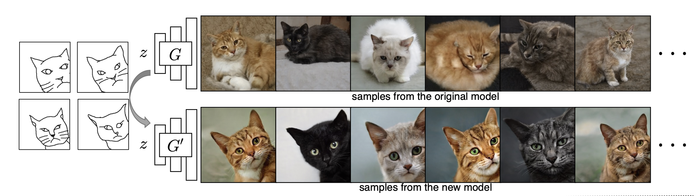
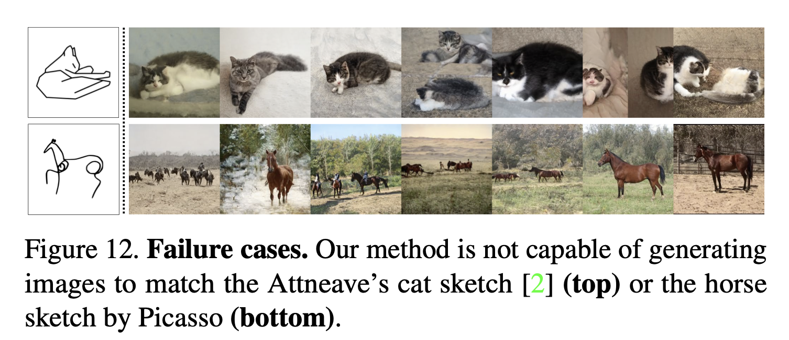

📌TL;DR: **How to customize GAN model given a few hand-drawn sketches**

## Problem 
* **👀 Motivation**: Rather than the collection of a large-scale dataset of exemplars, sketching is possibly the most universally accessible way to convey a visual concept.

* **❓ General Problem**: (Customization) Modify the weights of the original model (GAN) to match users' sketch. 

* **✅ Solved**: They change the weights of an original GAN model and match the model output according to user sketches given one or more sketches.

* **🤔 Unsolved**: 
  - It is not guarantee to work for all sketches. The method cannot create a model that matches the pose faithfully sometimes.
  - Customizing a model in real-time. This method takes more than 30K iterations to train. 
  - It cannot customize other properties such as color and texture.

* **💡 New Problem** : 
  - Is customizing or inference editing in real time worth it?

* **🌹 if the proposed algorithm fundamentally solves the given problem and if it does, think about which aspect of the algorithm makes the problem solved**
  - It was a key to interpet this cutomization as a cross-domain image translation task. 

# Paper

### Paper Info 
* Title : Sketch your own GAN
* Authors: 	Sheng-Yu Wang, David Bau, Jun-Yan Zhu
* Publication : 2021.09.20
* paper link : https://arxiv.org/pdf/2108.02774.pdf

### Page Info 
* Contributors: Sehyun Lee

## Summary 

## Discussion
Is there anything worthwhile to be customizing or speculative editing in real time? Is it a meaningful research direction?