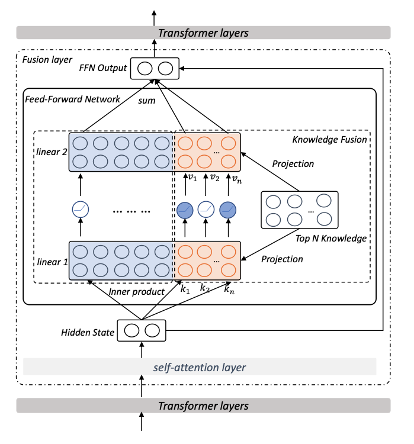

📌TL;DR: **Try to take advantage of the knowledge stored in PTMs and external knowledge via knowledge injection in Transformer FFN**

## Problem 
* **👀 Motivation**: The performance of the knowledge-driven downstream task is dependent on external knowledge → How to use the external knowledge?

* **❓ General Problem**: How can we integrate the external knowledge into pre-trained model?

* **✅ Solved**: knowledge injection in Transformer FFN layers
  

  - Choose knowledge candidates for knowledge injection via knowledge retrieval.
  - The external knowledge is then represented as the average of these tokens' embedding.
  - To project the embedded knowledge, use two different linear layers which will be updated during fine-tuning.
  - Expand the FFN by concatenating the projected knowledge to the end of the Linear layer.

* **🤔 Unsolved (Limitations)**:
  - It is inefficient since the external knowledge is temporarily added through concatenation rather than updating existing FFN neurons.

* **💡 New Problem** :
  - Is there any way to skip the retrieve or fine-tuning process?
  - If a fine-tuning process is needed anyway, it seems good to find an injection method that updates the parameters of the existing transformer.

* **🌹 if the proposed algorithm fundamentally solves the given problem and if it does, think about which aspect of the algorithm makes the problem solved**

# Paper

### Paper Info 
* Title : Kformer: Knowledge Injection in Transformer Feed-Forward Layers
* Authors: Yunzhi Yao, Shaohan Huang, Li Dong, Furu Wei, Huajun Chen, Ningyu Zhang
* Publication : 2022.08.10
* paper link : https://arxiv.org/pdf/2201.05742.pdf

### Page Info 
* Contributors: Youngju Joung
* 2023.05.10

## Summary 
* Contributions
  - Present a simple-yet-effective knowledge injection model Kformer to infuse the external knowledge into PLMs via Feed Forward Network.
  - Show the proposed appproach can obtain better performance and yield better interpretability.
* Analysis
  - Adding the knowledge into the top 3 layers' feed-forward layers usually performs well.
