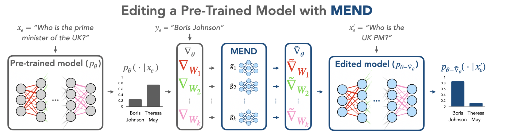
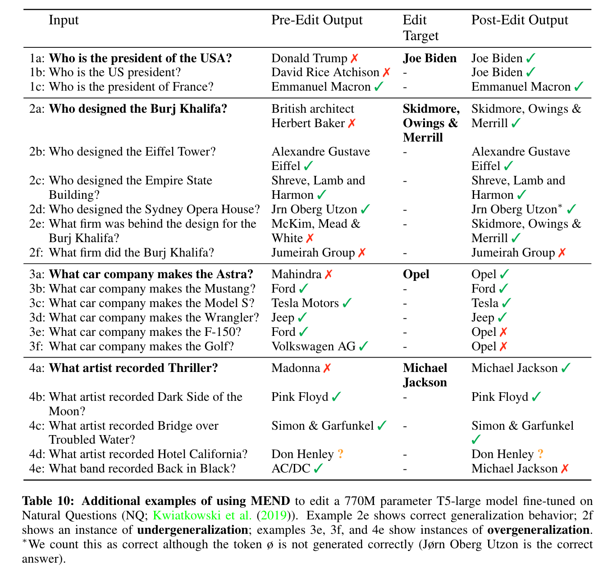

📌TL;DR: **A computationally efficient approach for learning to edit the behavior of very large pre-trained language models**

## Problem 
* **👀 Motivation**: Editing - detecting all such failures at training time is impossible, Editing large model - computationally infeasible or simply ineffective when applied to very large models

* **❓ General Problem**: Given the standard gradient of a given correction as input of a pretrained model, edit the model weights to output the correct answer. 

* **✅ Solved**: Fine-tune the pretrained model given a single pair of input and desired output all while leaving model behavior on unrelated inputs unchanged

* **🤔 Unsolved**: 
  - There are negative examples that the edit example’s output is correctly edited, but other examples in the equivalence neighborhood of the edit example do not change. Author suspect that negative examples are not challenging enough to prevent the model from sometimes changing its output for distinct but related inputs. 

* **💡 New Problem** : 
  - Given a pair of input and a correct answer, can we create a more difficult negative example that changes enough for its neighbors?
  - Can we build a dataset or evaluation protocol to test how much edited model is correctly edited other than backtranslation ? Counterfactual data augmentation (Kaushik et al., 2020) may be useful for constructing richer evaluation cases for edit generality. 
  - Can we build a editing method to cover more diverse types of editing such as reducing the frequency of toxic generations after observing toxic outputs, relabeling entire classes of images from one example, or adjusting a robot’s control policy to avoid particular actions?

* **🌹 if the proposed algorithm fundamentally solves the given problem and if it does, think about which aspect of the algorithm makes the problem solved**
    - As the name, Model Editor Networks with Gradient Decomposition (MEND), implies, it uses a collection of small auxiliary editing networks that use a single desired input-output pair to make fast, local edits to a pre-trained model’s behavior. Using a low-rank decomposition of the gradient to make the parameterization of this transformation tractable was key to transform the gradient obtained by standard fine-tuning. 

# Paper

### Paper Info 
* Title : FAST MODEL EDITING AT SCALE 
* Authors: Eric Mitchell, Charles Lin, Antoine Bosselut, Chelsea Finn, Christopher D. Manning
* Publication : 2022.01.13
* paper link : https://arxiv.org/pdf/2110.11309.pdf

### Page Info 
* Contributors: Sehyun Lee
* 2023.05.12

## Summary 
Even though how much the model is large, the large model can still make errors and accurate predictions may become outdated over time. That is the reasone why we need to correct inaccurate outputs while leaving the model otherwise intact is desirable. However, editing large neural networks to produce targeted edits is challenging. If presented with only a single problematic input and new desired output, fine-tuning approaches tend to overfit; other editing algorithms are either computationally infeasible or simply ineffective when applied to very large models. To enable easy post-hoc editing at scale, they propose Model Editor Networks with Gradient Decomposition (MEND), a collection of small auxiliary editing networks that use a single desired input-output pair to make fast, local edits to a pre-trained model. MEND learns to transform the gradient obtained by standard fine-tuning, using a low-rank decomposition of the gradient to make the parameterization of this transformation tractable. MEND can be trained on a single GPU in less than a day even for 10 billion+ parameter models; once trained MEND enables rapid application of new edits to the pre-trained model. Mostly, they test on LLM such as T5, GPT, BERT, and BART models.

## Discussion
Given a single pair, it would be interesting if we could generate a set of pairs to change the neighborhood a lot.