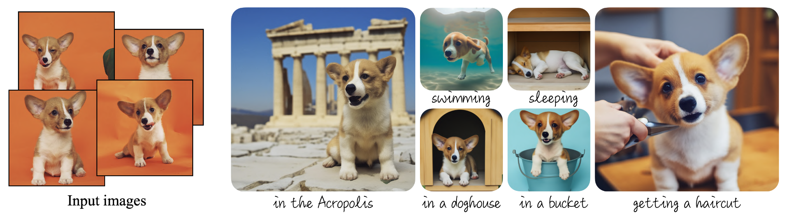
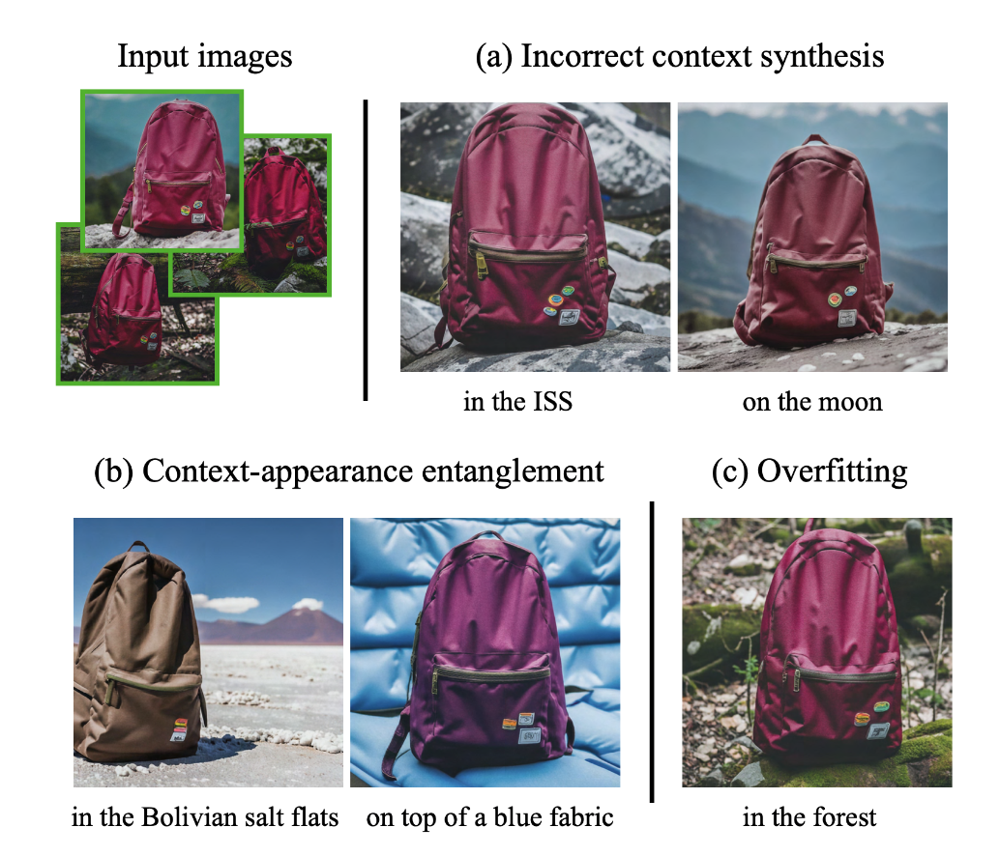

📌TL;DR: **How to personalize text-to-image diffusion models given a few images (3-5 images)**

## Problem 
* **👀 Motivation**: Existing large img2text models lack the ability to mimic the appearance of subjects in a given reference set and synthesize novel renditions of them in different contexts. 

* **❓ General Problem**: Given a particular subject, generate it in different contexts with SOTA text2img models, while maintaining high fidelity.

* **✅ Solved**: Fine-tune/"personalize" text2img model that encodes a unique identifier that referes to the subject in the reference set. Then, at inference, implant the unique identifier in different sentences to synthesize the subjects in difference contexts.

* **🤔 Unsolved**: How can we identify/extract the subject concept only? Fundamentally, they didn't separate the subject of a reference set and they give the reference set as a whole.
  - Context and subject entanglement: Due to a weak prior for the context or low probability of co-occurrence. 
  - Fails to generate images when using rare prompts: the appearance of the subject can change due to the prompted context
  - Overfitting; Mere copy of training set, if the prompt is similar to the original setting in which the subject was seen.
  - Some subjects are easier to learn than others (e.g. dogs and cats).
  - With subjects that are rarer, the model is unable to support as many subject variations.
  - Hallucinated subject features

* **💡 New Problem** : 
  - How can we make the subject and the context disentangle more actively? Is there a better way to distingish the subject and context in a reference set? 
  - How can we prevent the hallucination?
  - How can we control the diversity/variations, especially with a rare prompt and overlapped prompt compared to training set?
  - Can we identify the characteristics of hard subjects that can be learned in latent space level? 

* **🌹 if the proposed algorithm fundamentally solves the given problem and if it does, think about which aspect of the algorithm makes the problem solved**
    * To make this algorithm work, preventing language drift(forgetting) is critical and they propose a class-specific prior preservation loss.

# Paper

### Paper Info 
* Title : DreamBooth: Fine Tuning Text-to-Image Diffusion Models for Subject-Driven Generation  
* Authors: Nataniel Ruiz, Yuanzhen Li, Varun Jampani, Yael Pritch, Michael Rubinstein, Kfir Aberman
* Publication : 2023.03.15
* paper link : https://arxiv.org/abs/2208.12242

### Page Info 
* Contributors: Sehyun Lee
* 2023.04.30

## Summary 
Large text2img models shows remarkable imge synthesis performance from a given text prompt. However, these models lack the ability to mimic the appearance of subjects in a given reference set and synthesize novel renditions of them in different contexts. In this work, they present a new approach for "personalization" of text-to-image diffusion models. Given as input just a few images of a subject, they fine-tune a pretrained text-to-image model (here, Imagen) such that it learns to bind a unique identifier with that specific subject with a class-specific prior preservation loss. Once the subject is embedded in the output domain of the model, the unique identifier can then be used to synthesize images of the subject contextualized in different scenes. They also evaluate their technique to several previously-unassailable tasks, including subject recontextualization, text-guided view synthesis, appearance modification, and artistic rendering. It is good that they demonstrate their powerful erformance with previously-unassailable tasks. But, the distinction between the subject and the contexts are just considered by the examples in reference set and are not dealt with explictly. 

## Discussion
They strong "personalization" performance is supported by many previously-unassailable tasks, including subject recontextualization, text-guided view synthesis, appearance modification, and artistic rendering. However, the method don't separate the subject and the contexts of a reference set explicitly and rather do the distinction implicitly through the examples in the reference set. Therefore, following failure can happen. The subject and the contexts can be entangled due to a low probability of co-occurrence. In this case, the appearance of the subject can change due to the prompted context. It may fail to generate images when using rare prompts. Also, the diversity/variability can not be controlled in that mere copy of training set can be generated if the prompt is similar to the original setting in which the subject was seen. With subjects that are rarer, the model is unable to support as many subject variations. In some cases, it generates the hallucinated subject features.