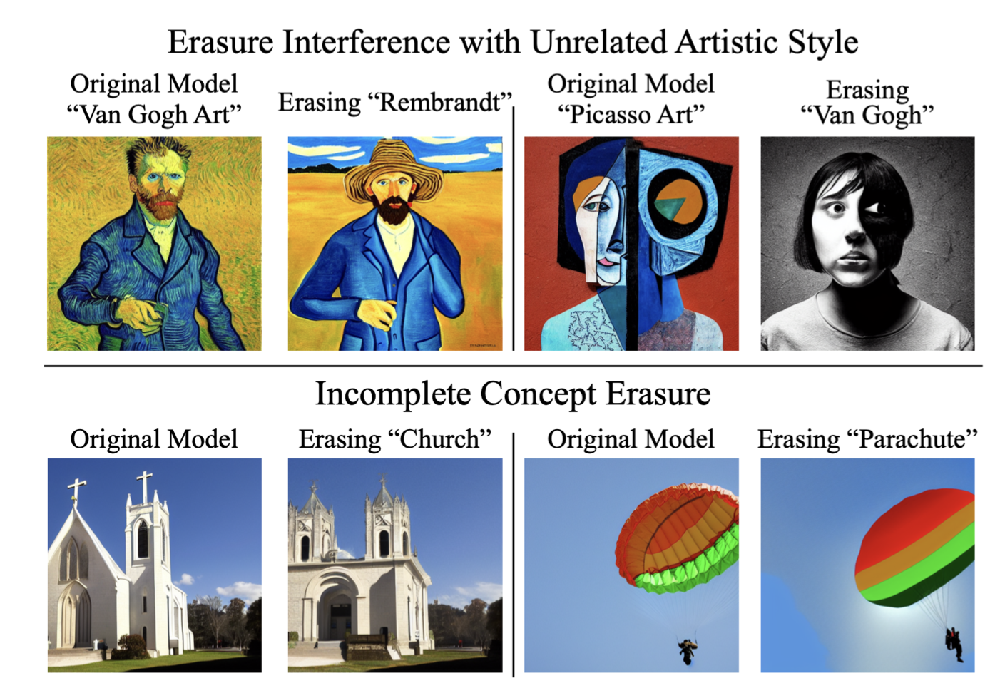

📌TL;DR: **How to erase concepts from diffusion model weights**

## Problem 
* **👀 Motivation**: Large-scale diffusion models can produce undesirable output such as sexually explicit content or copyrighted artistic styles due to the mimicing behavior of training dataset.

* **❓ General Problem**: Given the text description of the targeted concepts and using negative guidance as a teacher, fine-tune the pretrained diffusion model to erase a visual concept.

* **✅ Solved**: Fine-tune the diffusion model to erase the concept from text description permanently. 

* **🤔 Unsolved**: 
  - Trade-off between erasing large concepts such as entire object classes or some particular styles and interference with other visual concepts.
  - Failure to erase some concepts 

* **💡 New Problem** : 
  - What is the optimal layer set to erase the concept? From their finding that NSFW content can be generated without explicitly mentioning words such as "nudity", it was effective to modify all layers except cross attention layer. Usually, they modify only the cross attention layer. 
  - Can we analyze or identify the property of a concept between easily erased and almost inerasable?
  - Doesn't erasing in this way trigger other unintended behavior?

* **🌹 if the proposed algorithm fundamentally solves the given problem and if it does, think about which aspect of the algorithm makes the problem solved**
    - The effect of applying the erasure objective depends on the subst of parameters that is fine-tuned, and it is critical to use cross-attention layer since it serves as a gateway to the prompt while other parameters tend to contribute to a visual concept even if the concept is not mentioned in the prompt. 
    - It is brillient that guiding the modifying direction to mimic the noise that defined from the difference between the output conditioned on the prompt and the output unconditioned. 

# Paper

### Paper Info 
* Title : Erasing Concepts from Diffusion Models
* Authors: 	Rohit Gandikota, Joanna Materzynska, Jaden Fiotto-Kaufman, David Bau
* Publication : 2023.03.16
* paper link : https://arxiv.org/pdf/2303.07345.pdf

### Page Info 
* Contributors: Sehyun Lee
* 2023.05.12

## Summary 
They claim that modifying the model weights via fine-tuning is better than modifying the output at the inference time, so it cannot be circumvented even if a user has access to model weights. To erase the concept, they guide the model update to mimic the negative noise. Negative noise is defined by the different between the output of conditioned on the prompt and the output unconditioned from the original model. By erasing the concepts permanently, they contribute to erasing nudify, changing artistic styles, class removal and so on. However, this kind of global modification always include the risk of unintended effect as we can wee in discussion section. 

## Discussion
They state that modifying the model permanetly by fine-tuning is better than modifying the output at the inference time because it can not be bypassed easily even if a user has access to model weights. However, after editing the model, we still have some cases of failure. In that case, we may need inference time editing rather that modifying the model weights. Also, modifying the model weights always include the risk of unintened effect as we can see from a below figure.

