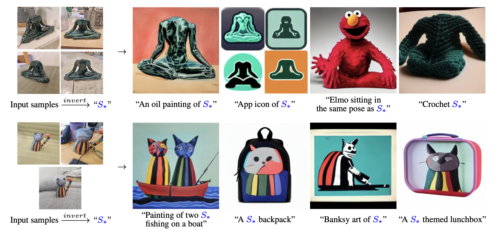

📌TL;DR: **How to edit text-conditional diffusion models using only a few imagess**

## Problem 
* **👀 Motivation**: It is unclear how Text2Img models generate images of specific unique concepts, modify their appearance, or compose them in new roles and novel scene.

* **❓ General Problem**: (Customization) How can we use language-guided models to turn our cat into a painting, or imagine a new product based on our favorite toy?

* **✅ Solved**: Given only 3-5 images like an object or a style, they modify the model to represent the concept through new “words” in the embedding space of a frozen text-to-image model.

* **🤔 Unsolved**: 

* **💡 New Problem** : 
  - Is customizing or inference editing in real time worth it?

* **🌹 if the proposed algorithm fundamentally solves the given problem and if it does, think about which aspect of the algorithm makes the problem solved**
  - It was a key to interpet this cutomization as a cross-domain image translation task. 

# Paper

### Paper Info 
* Title : Sketch your own GAN
* Authors: 	Sheng-Yu Wang, David Bau, Jun-Yan Zhu
* Publication : 2021.09.20
* paper link : https://arxiv.org/pdf/2108.02774.pdf

### Page Info 
* Contributors: Sehyun Lee

## Summary 

## Discussion
Is there anything worthwhile to be customizing or speculative editing in real time? Is it a meaningful research direction?